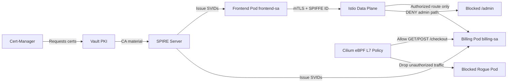
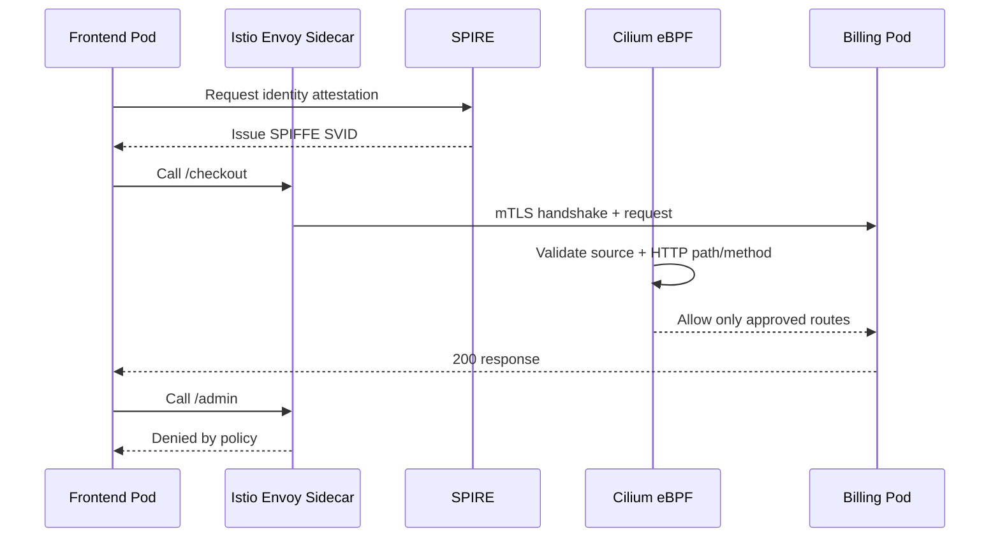
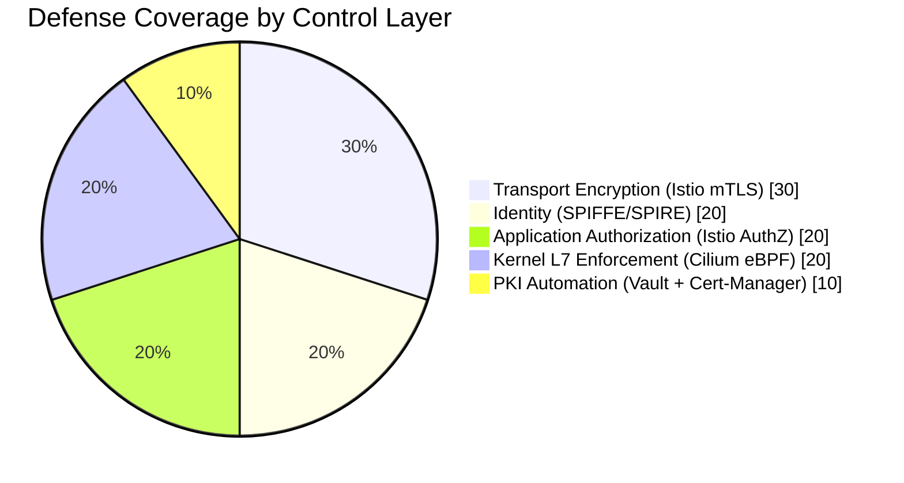

# Project 17: Zero-Trust Service Mesh (Portfolio Project)

Production-style platform project that demonstrates how to secure east-west Kubernetes traffic with identity, encryption, and kernel-level policy enforcement.

## Portfolio Summary

This project showcases a complete zero-trust architecture for regulated healthcare workloads.

- Business domain: Health-tech and HIPAA-aligned controls.
- Core objective: Allow only authorized service-to-service API flows.
- Security model: mTLS + SPIFFE identity + L7 policy enforcement.
- Platform model: Multi-cluster-ready with Cilium ClusterMesh patterns.

## Flagship Dashboard

The repo includes a dedicated React operations dashboard in [dashboard/index.html](dashboard/index.html) that presents the direct access links, validation runbook, and control matrix in a polished, interview-ready layout.

Run `./start.sh` and then open `http://127.0.0.1:8787/`.

If you want to launch it separately, run [dashboard/serve.sh](dashboard/serve.sh).

## Recruiter Snapshot (Infographic)

| Capability | What I Built | Proof in Repo |
| :--- | :--- | :--- |
| Zero-Trust Encryption | Strict mTLS between services | istio/authorization_policies.yaml |
| Workload Identity | SPIFFE/SPIRE-based identity registration | spire/client_registration.yaml |
| Route-Level Authorization | Allow /checkout, deny /admin | istio/authorization_policies.yaml |
| Kernel L7 Enforcement | eBPF HTTP method and path policy | cilium/l7_policy.yaml |
| PKI Automation | Vault-backed issuer with cert-manager | cert-manager/vault-issuer.yaml |
| Operations Dashboard | React control-center UI | dashboard/index.html |
| Deployment Automation | One-command apply and teardown | start.sh and stop.sh |

## Architecture Diagram



## Request Flow Sequence



## Security Control Coverage Chart



## Problem and Solution Mapping (Infographic)

| Risk | Control | Outcome |
| :--- | :--- | :--- |
| Service impersonation | SPIFFE identities | Verified workload identity |
| Plain-text east-west traffic | Strict mTLS | Encrypted service communication |
| Over-permissive APIs | Istio AuthorizationPolicy | Route-level least privilege |
| Bypass via network path | Cilium L7 eBPF rules | Packet drop before app processing |
| Manual certificate handling | Vault + cert-manager | Automated rotation workflow |

## Repository Layout

```text
17-zero-trust-service-mesh/
├── dashboard/
│   ├── app.js
│   ├── index.html
│   ├── serve.sh
│   └── styles.css
├── cilium/
│   ├── clustermesh.yaml
│   └── l7_policy.yaml
├── cert-manager/
│   ├── certificate.yaml
│   └── vault-issuer.yaml
├── istio/
│   ├── authorization_policies.yaml
│   └── gateway.yaml
├── kubernetes/
│   ├── namespaces.yaml
│   └── sample-apps.yaml
├── spire/
│   ├── client_registration.yaml
│   └── server_config.yaml
├── .gitignore
├── start.sh
└── stop.sh
```

## Prerequisites

- Kubernetes cluster (1.26+ recommended).
- kubectl configured to the target cluster.
- Istio installed (sidecar mode).
- Cilium installed with policy enforcement enabled.
- Optional: SPIRE operator and cert-manager installed.

## Quick Start

```bash
cd 17-zero-trust-service-mesh
chmod +x start.sh stop.sh
./start.sh
```

After deployment, open `http://127.0.0.1:8787/` for the full operations view.

## Validation Commands

1. Authorized service and route (expected success):

```bash
kubectl -n mesh-demo exec deploy/frontend -- sh -c 'curl -si http://billing:8080/checkout'
```

2. Authorized service but blocked route (expected deny):

```bash
kubectl -n mesh-demo exec deploy/frontend -- sh -c 'curl -si http://billing:8080/admin'
```

3. Unauthorized service (expected drop or timeout):

```bash
kubectl -n mesh-demo exec deploy/rogue -- sh -c 'curl -si --max-time 5 http://billing:8080/checkout || true'
```

4. mTLS verification (optional):

```bash
istioctl authn tls-check billing.mesh-demo.svc.cluster.local -n mesh-demo
```

## Implementation Phases

1. Identity system: configure Vault PKI and cert-manager issuer.
2. Identity bootstrap: register SPIFFE IDs via SPIRE.
3. Mesh enforcement: apply strict mTLS and Istio auth policies.
4. Kernel enforcement: apply Cilium HTTP L7 allowlist.
5. Audit and test: execute positive and negative access tests.

## Portfolio Outcomes

- Demonstrates defense-in-depth across identity, transport, application, and kernel layers.
- Shows practical policy-as-code design for regulated workloads.
- Highlights readiness for platform engineering, DevSecOps, and SRE security roles.

## Teardown

```bash
./stop.sh
```
